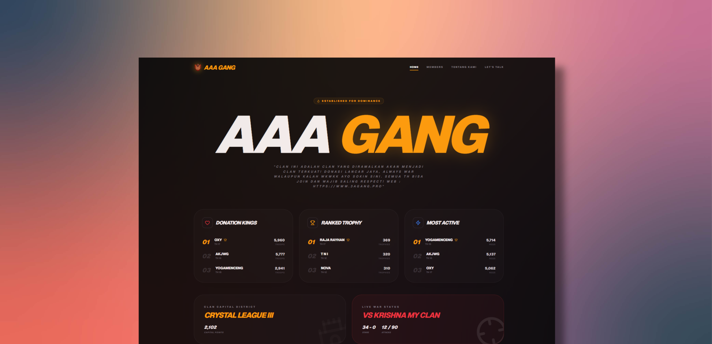

[](https://www.3agang.pro/)

# AAA GANG Dashboard

A production-ready Next.js application for the AAA GANG Clash of Clans community. The site displays clan statistics, member details, current war status, and includes an interactive chat assistant for clan-related questions.

## Features

- Clan overview with live war status and performance highlights
- Member leaderboards for donations, trophies, and engagement
- Responsive dark UI with modern, minimalist styling
- Interactive chat interface with local storage support
- Static asset handling via `public` directory for optimized badge loading
- Tailwind CSS styling with custom layouts and transitions

## Technology

- Next.js 16
- React 19
- TypeScript
- Tailwind CSS 4
- `lucide-react` for iconography
- `react-markdown` for formatted chat responses

## Repository Structure

- `src/app/` - application routes and page layouts
- `src/app/kontak/ChatInterface.tsx` - chat UI and client-side interaction
- `src/components/` - reusable UI components such as `Navbar` and `Footer`
- `src/lib/` - API helpers for Clash of Clans and player data
- `public/` - static assets and images

## Setup

### Requirements

- Node.js 20 or newer
- npm

### Install dependencies

```bash
npm install
```

### Run development server

```bash
npm run dev
```

Open `http://localhost:3000` in your browser to preview the app.

## Environment Variables

Create a `.env.local` file in the project root with the following variables:

```env
COC_API_KEY=your_clash_api_key
CLAN_TAG=%23YOUR_CLAN_TAG
MISTRAL_API_KEY=your_mistral_api_key
```

- `COC_API_KEY` is used to fetch clan and player data via the Clash of Clans proxy API.
- `CLAN_TAG` identifies the clan used by the dashboard.
- `MISTRAL_API_KEY` is used by the chat endpoint when an AI assistant backend is configured.

### Clash of Clans API Key Setup

1. Create an API key on the official Clash of Clans developer portal: https://developer.clashofclans.com/#/
2. If your server does not have a static IP address, use RoyaleAPI proxy. This proxy is especially useful for deployments that cannot maintain a fixed IP.
3. Whitelist the proxy IP address: `45.79.218.79`.
4. Substitute the official API domain with the proxy domain for Clash of Clans:
   - Official API: `https://api.clashofclans.com`
   - Proxy API: `https://cocproxy.royaleapi.dev`

For more details, see the RoyaleAPI proxy documentation:
- https://docs.royaleapi.com/proxy.html

### Proxy Usage Example

Use the proxy URL to call Clash of Clans endpoints with your official key:

```bash
curl -H "Authorization: Bearer YOUR_KEY" \
  https://cocproxy.royaleapi.dev/v1/clans/%23YOUR_CLAN_TAG
```

The same pattern applies to other Supercell game proxies:

- Clash Royale API proxy: `https://proxy.royaleapi.dev`
- Clash of Clans API proxy: `https://cocproxy.royaleapi.dev`
- Brawl Stars API proxy: `https://bsproxy.royaleapi.dev`

## Self-hosted LLM

This project can also connect to a self-hosted LLM backend. One example deployment is available on Hugging Face Spaces:

- https://agunghari2-llm-ministral3b-selfhosted.hf.space/
- https://huggingface.co/AgungHari2

A sample Dockerfile for a self-hosted `llama.cpp`-based model server:

```dockerfile
FROM ghcr.io/ggml-org/llama.cpp:server

WORKDIR /app

ENV PORT=7860
ENV HOST=0.0.0.0

USER root

RUN apt-get update && apt-get install -y curl && \
    curl -L https://huggingface.co/bartowski/mistralai_Ministral-3-3B-Instruct-2512-GGUF/resolve/main/mistralai_Ministral-3-3B-Instruct-2512-Q2_K.gguf -o /app/model.gguf && \
    chmod 777 /app/model.gguf

RUN echo '#!/bin/bash\
SERVER_PATH=$(which llama-server || find / -name llama-server 2>/dev/null | head -n 1)\
echo "Executing: $SERVER_PATH"\
exec $SERVER_PATH -m /app/model.gguf --host 0.0.0.0 --port 7860 -c 4096 --n-gpu-layers 0\
' > /app/start.sh && chmod +x /app/start.sh

ENTRYPOINT ["/bin/bash", "/app/start.sh"]
```

If you use this setup, configure the dashboard chat backend to point to the self-hosted model server.

For the exact HF Space call pattern and chat integration, review `src/app/api/chat/route2.txt`, especially the `baseURL` and API key usage for `https://agunghari2-llm.hf.space/v1`.

## Build and Production

Build the application for production:

```bash
npm run build
```

Start the production server:

```bash
npm start
```

## Notes

- The `Navbar` component references clan badge images from the `public/` folder.
- Chat history is persisted locally in the browser using local storage.
- The project is compatible with modern deployment platforms such as Vercel.

## License

This project is licensed under the MIT License. See the `LICENSE` file for full terms and permissions.
