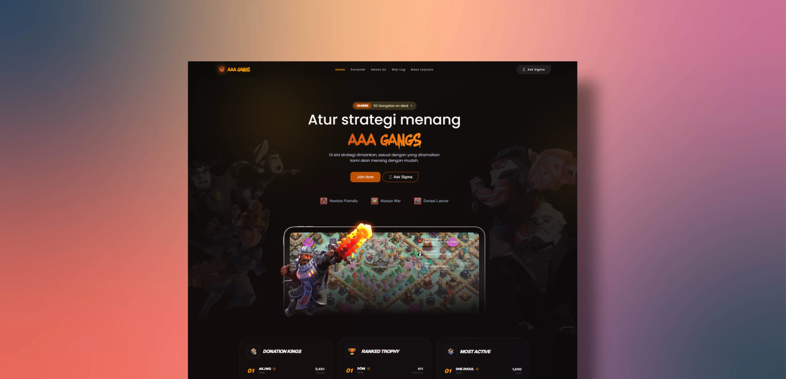

[](https://www.3agang.pro/)


[](https://www.3agang.pro/)
<table border="0">
  <tr>
    <td align="left" valign="middle">
      <br>
      <br>
      
    </td>
    <td align="left" valign="middle">
      <br>
      <br>
      
    </td>
    <td align="left" valign="middle">
      <br>
      <br>
      
    </td>
    <td align="right" valign="top">
      
    </td>
  </tr>
</table>
       
Next.js application for the AAA GANG Clash of Clans community. The site displays clan statistics, member details, current war status, and includes an interactive chat assistant for clan-related questions. You can use for your own clan, it provide utility for the clan.


## Disclaimer

> This repository is unofficial and is not endorsed by Supercell. For more information see Supercell’s Fan Content Policy.
> I do not endorse any third party, and I do not collect or monetize any data here.
> All content used in this repository is included with permission.
> Base layouts are provided as coaching material and may be offered commercially.

## Features

### Public Features
- **Clan Overview** - Live war status, clan level, member count, win/loss stats
- **Member Leaderboards** - Filter by donations, trophies, engagement
- **Base Layouts Gallery** - Community-contributed layouts with TH filtering, views, likes, descriptions
- **War Log** - Full clan war history with timestamps and results
- **News & Esports** - Latest Clash of Clans updates and competitive scene from Supercell
- **Member Profiles** - Individual player stats and details
- **Responsive Design** - Dark UI optimized for desktop and mobile
- **Interactive AI Chat** - Ask questions about base design, clan strategy, game mechanics (Sigma)
- **Map Integration** - Interactive Leaflet maps with markers and place autocomplete
- **Static Asset Handling** - Optimized badge loading via `public` directory
- **Tailwind CSS Styling** - Modern, minimalist design with custom animations

### AI Chat Features
- **Multi-Model Support** - Switch between self-hosted LLM
- **Clan Context** - AI has access to real-time clan data (members, war stats)
- **Game Knowledge** - Some Pre-trained with Clash of Clans strategies, equipment, farming guides
- **Local History** - Chat persists in browser localStorage
- **Layout-Specific Chat** - Ask questions about individual base layouts
- **Markdown Responses** - Rich formatted responses with links and formatting

### Map & Location Features
- **Leaflet Maps** - Interactive map with marker clustering
- **Full Screen Mode** - Expanded map viewing
- **Place Autocomplete** - Search locations with autocomplete
- **Marker Customization** - Draw and manage markers on maps

### Admin Features for Base layouts
- **Layout Metadata** - Track views (server-side), likes (client-side), sources, descriptions
- **Markdown Editor** - Rich description editing with Markdown formatting
- **Authentication** - Rate limiting (5 login attempts per 15 minutes)
- **Bulk Management** - Manage multiple layouts from dashboard

### News & Content Features
- **Supercell News Integration** - Fetch official Clash updates
- **Esports Coverage** - Competitive Clash of Clans news
- **YouTube Embedding** - Extract and embed YouTube videos from URLs
- **Article Filtering** - Organize by category and date

### Additional Pages
- **Coaching Resources** - Clan coaching and strategy guides
- **About Page** - Clan information and history
- **Contact Page** - Contact form for inquiries
- **Privacy Policy** - GDPR and privacy information
- **Terms of Service** - Legal terms
- **DMCA** - Copyright notice handling

### Admin Features
- **Admin Dashboard** - Manage base layouts with full CRUD operations
- **Authentication** - JWT-based admin login with rate limiting (5 attempts per 15 minutes)
- **Layout Management** - Create, read, update, and delete base layouts
- **Content Metadata** - Track views, likes, source URLs, and upload dates
- **Markdown Support** - Rich descriptions with markdown formatting for layout details

## Setup


### Requirements

- Node.js 20 or newer
- npm

### Install dependencies

```bash
npm install
```

### Run development server

```bash
npm run dev
```

Open `http://localhost:3000` in your browser to preview the app.

## Technology

### Core Stack
- **Next.js 16** - React framework with App Router and API routes
- **React 19** - UI library
- **TypeScript** - Type safety
- **Tailwind CSS 4** - Utility-first CSS framework

### UI & Components
- **Shadcn/UI** - Pre-built, accessible component library
- **Radix UI** - Headless component library
- **Class Variance Authority** - Type-safe component variants
- **Lucide React** - Icon library (20+ clan-related icons)
- **CLSX** - Class name utility
- **Tailwind Merge** - Tailwind CSS class merging

### Maps & Geolocation
- **Leaflet** - Interactive maps library
- **React-Leaflet** - React wrapper for Leaflet
- **Leaflet Draw** - Draw tools for maps
- **Leaflet Marker Cluster** - Cluster nearby markers
- **Leaflet Fullscreen** - Full screen map mode

### AI & LLM Integration
- **OpenAI** - OpenAI API client (GPT support)
- **Google Generative AI** - Google Gemini API support
- **Custom LLM Support** - Self-hosted LLM via OpenAI-compatible API

- **OpenAI GPT-5** - The next-generation flagship model
- **OpenAI GPT-5-mini** - High-speed, high-intelligence efficiency model
- **OpenAI GPT-5-turbo** - High-throughput GPT-5 model for Sigma
- **OpenAI o2-preview** - Advanced scientific reasoning and complex problem solving
- **OpenAI o1-pro** - The ultimate reasoning model for technical architecture
- **OpenAI gpt-4o** - credit : this model have save my life once
- **OpenAI gpt-4o-mini** - Pro/Plus Level
- **OpenAI gpt-4-turbo** - OpenAI standard GPT offering
- **OpenAI o1-preview** - Newest reasoning model series
- **OpenAI o1-mini** - Compact and fast reasoning

- **Anthropic Claude 4 Opus** - Most powerful model with near-human nuance
- **Anthropic Claude 4 Sonnet** - Speed and intelligence balance
- **Anthropic Claude 4 Haiku** - Instant responses with large context window
- **Anthropic Claude 3.5 Sonnet** - Anthropic's speed-oriented reasoning
- **Anthropic Claude 3 Opus** - Classic reasoning model
- **Anthropic Claude 3 Haiku** - Fast response with solid understanding

- **Google Gemini 3.1** - Multimodal powerhouse for complex COC strategy analysis
- **Google Gemini 2.0 Pro** - Large context window (up to 5M tokens)
- **Google Gemini 2.0 Flash** - Sub-second latency for real-time Sigma Basic interaction
- **Google Gemma 4** - Latest Google open-weight family
- **Google Gemma 3** - Established large language model support
- **Google Gemma 2 27B** - High-capacity Google model
- **Google Gemma 2 9B** - Balanced Google performance
- **Google Gemma 2 2B** - Lightweight Google option

- **Meta Llama 4 (405B)** - Open-weight king for private "Plateau" deployments
- **Meta Llama 4 (70B)** - Optimized for high-concurrency clan management
- **Meta Llama 4 (8B)** - The ultimate "Lite" model with Llama 3-level intelligence
- **Meta Llama 3.2 3B Instruct** - Lite instruction-tuned model
- **Meta Llama 3.2 1B** - Small Meta Llama model
- **Meta Llama 2 70B** - Mature large-scale model support

- **Mistral Large 3** - Mistral's latest European flagship model
- **Mixtral 8x25B** - Next-gen mixture-of-experts for diverse tasks
- **Codestral v2** - Code-specialized model for advanced automation
- **Mistral large latest** - The original flagship Mistral model
- **Mistral medium latest** - Balanced Mistral for Sigma Basic/Plus has no limit
- **Mistral small latest** - Fast & efficient Mistral
- **Open Mixtral 8x22B** - Mistral variant for general use
- **Open Mistral Nemo** - Reasoning-focused Mistral variant
- **Codestral latest** - Code-optimized Mistral branch
- **Pixtral 12B** - Mistral-based midweight model

- **xAI Grok-3** - Massive scale model with real-time X knowledge integration
- **xAI Grok-3-mini** - Fast reasoning with xAI personality
- **xAI Grok-2** - Reliable xAI reasoning model
- **xAI Grok-1.5** - Lightweight xAI model
- **xAI Grok-1** - Entry-level xAI model

- **OpenWeight** - OpenWeight hub support for GPT-5, Mistral, Grok, Claude, Gemma, Llama
- **OpenWeight GPT-5** - OpenWeight GPT-5 variant
- **OpenWeight GPT-4o** - OpenWeight GPT-4o variant
- **OpenWeight Mistral 7B** - Community open-weight Mistral variant
- **OpenWeight Llama 3.1 70B** - Open-weight Llama variant
- **OpenWeight Claude 3** - Open-weight Claude variant
- **OpenWeight Grok 2** - Open-weight Grok variant

- **DeepSeek V4** - Latest DeepSeek large model
- **DeepSeek V3** - Previous generation DeepSeek model
- **DeepSeek Coder V3** - Smart contract and complex logic development specialist

- **Alibaba Qwen 3.0 (72B)** - Latest world-class open model
- **Alibaba Qwen 3.0-Coder** - Top-tier infrastructure build performance
- **Alibaba Qwen Math V2** - Hyper-accurate calculations for Ore and upgrades
- **Alibaba Qwen 2.5 72B Instruct** - Highly recommended Alibaba model
- **Alibaba Qwen 2.5 32B** - Balanced Alibaba model
- **Alibaba Qwen 2.5 14B** - Midweight Alibaba model
- **Alibaba Qwen 2.5 7B** - Efficient Alibaba model
- **Alibaba Qwen 2.5 Coder** - Developer-focused Alibaba model

- **Microsoft Phi-4** - Small Language Model with GPT-4 class reasoning
- **Microsoft Phi 3.5 Moe** - Experimental mixture-of-experts
- **Microsoft Phi 3.5 Mini Instruct** - Old/Lite Microsoft option
- **Microsoft Phi 3.5 Vision** - Vision-capable Microsoft model

- **Nvidia Nemotron 4 340B** - Synthetic data generation and human-like dialogue
- **Nvidia Nemotron 70B Instruct** - High-quality humanlike instruction support
- **Nvidia Megatron Turing** - Nvidia research model

- **Hugging Face Zephyr 7B Beta** - Open-source Hugging Face model
- **Nous Research Hermes 4** - Advanced creative and roleplay assistant
- **Nous Research Hermes 3 Llama 3.1** - Earlier Nous Research model
- **Nous Research Nous-Hermes 2 Mixtral** - Mixed-model Nous Research variant

- **TII Falcon 3 (180B)** - Latest TII flagship model
- **TII Falcon 180B** - Large-scale open model
- **TII Falcon 2 11B** - Efficient TII model

- **Upstage Solar-Pro** - Flagship instruction following model
- **Upstage Solar Mini Chat** - Lightweight Upstage chat model

- **Stability AI Stable Beluga** - Stability AI instruction model

- **01-AI Yi 1.5 34B Chat** - Large chat-optimized model
- **01-AI Yi Lightning** - Fast lightweight chat model

- **Cognitive Computations Dolphin 3.0** - Hyper-flexible open-weight model
- **Cognitive Computations Dolphin 2.9.4 Llama 3** - Earlier open-weight variant

- **Perplexity Sonar Large** - High-performance retrieval model
- **Perplexity Sonar Medium** - Balanced Perplexity model
- **Perplexity Sonar Small** - Lightweight Perplexity model

- **Cohere Command R-v2** - Long-context RAG for clan documentation
- **Cohere Command R-plus** - Earlier Cohere reasoning model

- **Databricks DBRX Instruct** - Databricks instruction model

- **Jamba 1.5** - AI21 hybrid architecture for ultra-long contexts
- **Liquid-LFM-Large** - Non-transformer infinite-sequence processing model
- **OpenELM-2** - Apple on-device efficient model support
- **Reka Core** - Multimodal base layout recognition model
- **AuraFlow v2** - High-fidelity layout generation model
- **Reflection-70B** - Advanced self-reasoning and error correction
- **OpenRouter Unified** - Access to 200+ decentralized open-source models
- **Ollama / LocalAI Bridge** - GGUF/Safetensors local model hosting support
- **vLLM / TGI Cluster** - Enterprise-grade self-hosted orchestration

### Animations & Effects
- **Framer Motion** - React animation library
- **Motion** - Animation primitives
- **React Fast Marquee** - Marquee/scrolling text
- **TW Animate CSS** - Tailwind CSS animation utilities

### Utilities & Libraries
- **Jose** - JWT token signing and verification
- **@libsql/client** - Turso SQLite database client
- **React Markdown** - Markdown rendering in React
- **Remark GFM** - GitHub-flavored Markdown support
- **React Cookie Consent** - Cookie consent banner
- **Next Themes** - Dark mode support
- **Simple Icons** - Icon pack

## Pages & Routes

### Public Pages
| Route | File | Description |
|-------|------|-------------|
| `/` | `src/app/page.tsx` | Homepage with clan hero, highlights, stats |
| `/layout` | `src/app/layout/page.tsx` | Base layouts gallery with TH filtering |
| `/layout/[id]` | `src/app/layout/[id]/page.tsx` | Individual layout detail, views, likes, markdown description |
| `/members` | `src/app/members/page.tsx` | Clan member list with leaderboards |
| `/members/[tag]` | `src/app/members/[tag]/page.tsx` | Individual member profile and stats |
| `/warlog` | `src/app/warlog/page.tsx` | Clan war history and battle logs |
| `/news` | `src/app/news/page.tsx` | News & updates aggregation page |
| `/news/article/[id]` | `src/app/news/article/[id]/page.tsx` | Individual news article |
| `/news/esports/[id]` | `src/app/news/esports/[id]/page.tsx` | Esports news and competitive updates |
| `/sigma` | `src/app/sigma/page.tsx` | AI chat assistant (σ Sigma) |
| `/coaching` | `src/app/coaching/page.tsx` | Coaching resources and guides |
| `/tentang` | `src/app/tentang/page.tsx` | About the clan |
| `/contact` | `src/app/contact/page.tsx` | Contact form |
| `/privacy` | `src/app/privacy/page.tsx` | Privacy policy |
| `/termsofservice` | `src/app/termsofservice/page.tsx` | Terms of service |
| `/dmca` | `src/app/dmca/page.tsx` | DMCA copyright notices |

### Admin Pages (Protected)
| Route | File | Description |
|-------|------|-------------|
| `/admin/login` | `src/app/admin/login/page.tsx` | Admin login with rate limiting |
| `/admin/dashboard` | `src/app/admin/dashboard/page.tsx` | View all layouts, manage content |
| `/admin/dashboard/new` | `src/app/admin/dashboard/new/page.tsx` | Create new base layout |
| `/admin/dashboard/edit/[id]` | `src/app/admin/dashboard/edit/[id]/page.tsx` | Edit existing layout |

### API Routes
| Endpoint | Method | Description | Auth |
|----------|--------|-------------|------|
| `/api/chat` | POST | AI chat endpoint (Mistral/OpenAI/self-hosted LLM) | Optional |
| `/api/proxy` | POST | Turso database proxy (CRUD layouts) | JWT Required |

### Special Routes
| File | Description |
|------|-------------|
| `src/app/layout.tsx` | Root layout wrapper, global styles, providers |
| `src/app/sitemap.ts` | Dynamic XML sitemap for SEO |
| `src/app/globals.css` | Global Tailwind CSS styles |
| `src/app/loading.tsx` | Loading UI for async routes |
| `src/app/not-found.tsx` | 404 error page |

## Components Architecture

### Layout Components
- **`LayoutCard.tsx`** - Display base layout in gallery (image, TH level, actions)
- **`LayoutDescription.tsx`** - Render markdown description
- **`LayoutMetaInfo.tsx`** - Show metadata (TH, base tag, copy link)
- **`LayoutStats.tsx`** - Display view/like counters
- **`LayoutPageChat.tsx`** - Chat interface on layout detail page
- **`LayoutsFilter.tsx`** - Filter layouts by TH level
- **`RelatedLayoutsList.tsx`** - Show related layouts
- **`PreviewButtons.tsx`** - Copy link and preview actions
- **`DeleteLayoutButton.tsx`** - Admin delete functionality
- **`LikeButton.tsx`** - Like counter with localStorage tracking

### Chat Components
- **`ChatMessages.tsx`** - Display message thread
- **`ChatInput.tsx`** - Input field with model selector
- **`ChatHeader.tsx`** - Chat title and info
- **`MessageItem.tsx`** - Individual message rendering
- **`ModelSelector.tsx`** - Switch between AI models (Mistral, OpenAI, self-hosted)
- **`ConsoleLogger.tsx`** - Debug console for development

### War & Member Components
- **`WarStatusCard.tsx`** - Current war status display
- **`WarLogCard.tsx`** - Individual war log entry
- **`WarLogFilter.tsx`** - Filter war logs
- **`WarTestimonial.tsx`** - War highlights section
- **`WarTestimonialCard.tsx`** - Individual testimonial card
- **`LeaderboardCard.tsx`** - Member ranking display
- **`HallOfFame.tsx`** - Top players showcase

### News & Info Components
- **`NewsCard.tsx`** - News article card in grid
- **`AboutCard.tsx`** - About section cards
- **`ClanCapitalCard.tsx`** - Clan capital information

### Navigation & Layout
- **`Navbar.tsx`** - Top navigation bar with links
- **`Footer.tsx`** - Site footer
- **`SectionTitle.tsx`** - Section heading component
- **`SectionDivider.tsx`** - Visual section separator
- **`TimelineItem.tsx`** - Timeline event component

### Media & Effects
- **`TiltImage.tsx`** - 3D tilt image effect
- **`DecorativeHeroes.tsx`** - Decorative hero unit graphics
- **`ScrollReveal.tsx`** - Scroll-triggered animations
- **`MorphingTitle.tsx`** - Animated morphing text

### Map Components
- **`mapwithmarker.tsx`** - Leaflet map with markers enabled
- **`mapwithmarkeroff.tsx`** - Leaflet map without markers
- **`place-autocomplete.tsx`** (UI) - Location search autocomplete

### Utility Components
- **`CopyLinkBox.tsx`** - Copy-to-clipboard utility
- **`SourceSection.tsx`** - Attribution and source links
- **`GoogleAnalytics.tsx`** - GA integration
- **`GoogleAdSense.tsx`** - AdSense integration
- **`CookiebotProvider.tsx`** - Cookie consent provider

### Base UI Components (Shadcn)
Located in `src/components/ui/`:
- `button.tsx` - Button component
- `input.tsx` - Text input
- `textarea.tsx` - Text area
- `dialog.tsx` - Modal dialog
- `dropdown-menu.tsx` - Dropdown menu
- `command.tsx` - Command palette
- `separator.tsx` - Visual separator
- `spinner.tsx` - Loading spinner
- `button-group.tsx` - Grouped buttons
- `input-group.tsx` - Input with label

## Utilities & Helpers

### API & Data Fetching
- **`lib/coc.ts`** - Clash of Clans API integration
  - `getClanData()` - Fetch clan statistics
  - `getCurrentWar()` - Get active war info
  - `getWarLog()` - Fetch war history
  
- **`lib/player.ts`** - Player data utilities
  - Player profile fetching and parsing
  
- **`lib/newsHelper.ts`** - News content processing
  - `fetchNewsContent()` - Fetch from Supercell
  - `fetchEsportContent()` - Fetch esports data
  - `extractYouTubeId()` - Parse YouTube URLs

### Server Actions (Database Operations)
- **`src/app/admin/action.ts`**
  - `loginAction()` - Admin authentication

- **`src/app/layout/action.ts`**
  - `incrementViewCount()` - Track layout views
  - `incrementLikeCount()` - Track likes

- **`src/app/admin/dashboard/action.ts`**
  - `updateLayout()` - Edit layout
  - `deleteLayout()` - Remove layout

- **`src/app/admin/dashboard/new/action.ts`**
  - `createLayout()` - Create new layout

### Security & Rate Limiting
- **`lib/rateLimit.ts`**
  - `checkRateLimit()` - Enforce rate limits
  - `getRemainingAttempts()` - Get remaining tries
  - `getResetTime()` - Get reset timestamp

### General Utilities
- **`lib/utils.ts`**
  - `cn()` - Merge classnames with Tailwind

- **`lib/mockData.ts`**
  - Mock war highlights for development

## Context Providers (State Management)

### Layout Context
- **`context/layout/layoutBaseContext.ts`**
  - `LayoutBase` interface for base layouts
  - Layout state and operations

### Clash of Clans Game Context
- **`context/clash/gameContext.ts`** - Game mechanics
- **`context/clash/strategiContext.ts`** - Strategy information
- **`context/clash/importantContext.ts`** - Important clan info
- **`context/clash/equipmentOreContext.ts`** - Equipment & ore data
- **`context/clash/FarmingOreContext.ts`** - Farming strategies
- **`context/clash/ListEquipment.ts`** - Equipment inventory
- **`context/clash/datadiriContext.ts`** - General data directory

## Environment Variables

Create a `.env.local` file in the project root with the following variables:

```env
BASIC_API_KEY=your_self_hosted_llm_api_key
BASIC_BASE_URL=https://your.selfhosted.llm/v1
SELF_HOSTED_API_KEY=your_self_hosted_llm_api_key
SELF_HOSTED_BASE_URL=https://your.selfhosted.llm/v1
SELF_HOSTED_OLD_API_KEY=your_legacy_self_hosted_llm_api_key
SELF_HOSTED_OLD_BASE_URL=https://your.old.selfhosted.llm/v1
COC_API_KEY=your_clash_api_key
CLAN_TAG=%23YOUR_CLAN_TAG
TURSO_DATABASE_URL=your_turso_database_url
TURSO_AUTH_TOKEN=your_turso_auth_token
JWT_SECRET=your_jwt_secret_key
ADMIN_USERNAME=admin_username
ADMIN_PASSWORD=admin_password
NEXT_PUBLIC_ADSENSE_ID=ca-pub-xxxxxxxxxxxxxxxx
NEXT_PUBLIC_GA_ID=G-XXXXXXXXXX
```

- `BASIC_API_KEY` and `BASIC_BASE_URL` are used by the default AI chat backend.
- `SELF_HOSTED_API_KEY` and `SELF_HOSTED_BASE_URL` configure the current self-hosted model server.
- `SELF_HOSTED_OLD_API_KEY` and `SELF_HOSTED_OLD_BASE_URL` configure the legacy self-hosted model server.
- `OPENROUTER_API_KEY` is used for OpenRouter / open-weight model access.
- `COC_API_KEY` is used to fetch clan and player data via the Clash of Clans proxy API.
- `CLAN_TAG` identifies the clan used by the dashboard.
- `TURSO_DATABASE_URL` & `TURSO_AUTH_TOKEN` are Turso SQLite database credentials for base layouts storage.
- `JWT_SECRET` is the secret key used for JWT token signing (admin authentication).
- `ADMIN_USERNAME` & `ADMIN_PASSWORD` are the admin credentials for dashboard login.
- `NEXT_PUBLIC_ADSENSE_ID` is the Google AdSense publisher ID (optional).
- `NEXT_PUBLIC_GA_ID` is the Google Analytics tracking ID (optional).


## Database Setup

> Note: data ingestion and model analysis are handled by separate internal repositories.
> A Reddit scraper repo populates base layout data, and a separate LLM multi-model analysis repo performs advanced layout evaluation.
> These tools are not included in this dashboard repository.


### Turso SQLite Database

This project uses **Turso** (SQLite edge database) to store base layouts. The `layouts` table schema:

```sql
CREATE TABLE layouts (
  id INTEGER PRIMARY KEY AUTOINCREMENT,
  th_level INTEGER NOT NULL,
  base_tag TEXT NOT NULL,
  copy_link TEXT NOT NULL,
  image_url TEXT,
  description TEXT,
  source_type TEXT,
  source_url TEXT,
  view_count INTEGER DEFAULT 0,
  like_count INTEGER DEFAULT 0,
  upload_date DATETIME DEFAULT CURRENT_TIMESTAMP,
  is_active BOOLEAN DEFAULT TRUE
);
```

**Columns:**
- `th_level` - Town Hall level (1-18)
- `base_tag` - Unique base identifier/name
- `copy_link` - In-game copy link for the layout
- `image_url` - Preview image URL
- `description` - Markdown-formatted layout description
- `source_type` - Source type (youtube, reddit, custom, etc)
- `source_url` - External source URL
- `view_count` - Number of times layout was viewed
- `like_count` - Number of likes received
- `upload_date` - Timestamp when layout was added
- `is_active` - Boolean to soft-delete layouts

### Admin Dashboard Access

**Routes:**
- `/admin/login` - Admin login page
- `/admin/dashboard` - Layout management dashboard (protected)
- `/admin/dashboard/new` - Create new layout (protected)
- `/admin/dashboard/edit/[id]` - Edit layout (protected)

**Authentication:**
- JWT-based session management
- Rate limiting: 5 login attempts per 15 minutes
- HttpOnly cookies for token storage
- Admin access requires valid credentials from environment variables

## Clash of Clans API Key Setup

1. Create an API key on the official Clash of Clans developer portal: https://developer.clashofclans.com/#/
2. If your server does not have a static IP address, use RoyaleAPI proxy. This proxy is especially useful for deployments that cannot maintain a fixed IP.
3. Whitelist the proxy IP address: `45.79.218.79`.
4. Substitute the official API domain with the proxy domain for Clash of Clans:
   - Official API: `https://api.clashofclans.com`
   - Proxy API: `https://cocproxy.royaleapi.dev`

For more details, see the RoyaleAPI proxy documentation:
- https://docs.royaleapi.com/proxy.html

### Proxy Usage Example

Use the proxy URL to call Clash of Clans endpoints with your official key:

```bash
curl -H "Authorization: Bearer YOUR_KEY" \
  https://cocproxy.royaleapi.dev/v1/clans/%23YOUR_CLAN_TAG
```

The same pattern applies to other Supercell game proxies:

- Clash Royale API proxy: `https://proxy.royaleapi.dev`
- Clash of Clans API proxy: `https://cocproxy.royaleapi.dev`
- Brawl Stars API proxy: `https://bsproxy.royaleapi.dev`

## Self-hosted LLM

This project can also connect to a self-hosted LLM backend. One example deployment is available on Hugging Face Spaces:

- https://agunghari2-llm-ministral3b-selfhosted.hf.space/
- https://huggingface.co/AgungHari2

A sample Dockerfile for a self-hosted `llama.cpp`-based model server:

```dockerfile
FROM ghcr.io/ggml-org/llama.cpp:server

WORKDIR /app

ENV PORT=7860
ENV HOST=0.0.0.0

USER root

RUN apt-get update && apt-get install -y curl && \
    curl -L https://huggingface.co/bartowski/mistralai_Ministral-3-3B-Instruct-2512-GGUF/resolve/main/mistralai_Ministral-3-3B-Instruct-2512-Q2_K.gguf -o /app/model.gguf && \
    chmod 777 /app/model.gguf

RUN echo '#!/bin/bash\
SERVER_PATH=$(which llama-server || find / -name llama-server 2>/dev/null | head -n 1)\
echo "Executing: $SERVER_PATH"\
exec $SERVER_PATH -m /app/model.gguf --host 0.0.0.0 --port 7860 -c 4096 --n-gpu-layers 0\
' > /app/start.sh && chmod +x /app/start.sh

ENTRYPOINT ["/bin/bash", "/app/start.sh"]
```

If you use this setup, configure the dashboard chat backend to point to the self-hosted model server.

For the exact HF Space call pattern and chat integration, review `src/app/api/chat/route2.txt`, especially the `baseURL` and API key usage for `https://agunghari2-llm.hf.space/v1`.

## SEO & Sitemap

The project generates `sitemap.xml` automatically at `/sitemap.xml` using Next.js metadata routes.

**Sitemap Priority & Update Frequency:**
- Homepage `/` - Priority 0.9, daily
- `/layout` - Priority 0.8, daily
- `/news` - Priority 0.8, daily
- `/coaching` - Priority 0.8, daily
- `/members` - Priority 0.8, daily
- `/sigma` - Priority 0.8, daily
- `/warlog` - Priority 0.6, daily
- `/tentang` - Priority 0.6, daily
- `/privacy` - Priority 0.5, monthly
- `/contact` - Priority 0.5, monthly
- `/termsofservice` - Priority 0.5, monthly
- `/dmca` - Priority 0.5, monthly

The sitemap also includes dynamic pages for:
- `/news/article/[id]`
- `/news/esports/[id]`
- `/layout/[id]`
- `/members/[tag]`

**Admin routes** (`/admin/*`) are excluded from sitemap as they require authentication.

## Build and Production

Build the application for production:

```bash
npm run build
```

Start the production server:

```bash
npm start
```

## Repository Structure

```
src/
├── app/
│   ├── admin/
│   │   ├── action.ts
│   │   ├── login/
│   │   │   └── page.tsx
│   │   └── dashboard/
│   │       ├── action.ts
│   │       ├── page.tsx
│   │       ├── new/
│   │       │   ├── action.ts
│   │       │   └── page.tsx
│   │       └── edit/
│   │           └── [id]/
│   │               └── page.tsx
│   ├── api/
│   │   ├── chat/
│   │   │   └── route.ts
│   │   └── proxy/
│   │       └── route.ts
│   ├── layout/
│   │   ├── action.ts
│   │   ├── page.tsx
│   │   └── [id]/
│   │       └── page.tsx
│   ├── members/
│   │   ├── page.tsx
│   │   └── [tag]/
│   │       └── page.tsx
│   ├── news/
│   │   ├── page.tsx
│   │   ├── article/
│   │   │   └── [id]/
│   │   │       └── page.tsx
│   │   └── esports/
│   │       └── [id]/
│   │           └── page.tsx
│   ├── warlog/
│   │   └── page.tsx
│   ├── sigma/
│   │   ├── ChatInterface.tsx
│   │   └── page.tsx
│   ├── coaching/
│   │   └── page.tsx
│   ├── tentang/
│   │   └── page.tsx
│   ├── contact/
│   │   └── page.tsx
│   ├── privacy/
│   │   └── page.tsx
│   ├── termsofservice/
│   │   └── page.tsx
│   ├── dmca/
│   │   └── page.tsx
│   ├── layout.tsx
│   ├── page.tsx
│   ├── globals.css
│   ├── loading.tsx
│   ├── not-found.tsx
│   └── sitemap.ts
├── components/
│   ├── ui/
│   │   ├── button.tsx
│   │   ├── input.tsx
│   │   ├── textarea.tsx
│   │   ├── dialog.tsx
│   │   ├── dropdown-menu.tsx
│   │   ├── command.tsx
│   │   ├── separator.tsx
│   │   ├── spinner.tsx
│   │   ├── button-group.tsx
│   │   ├── input-group.tsx
│   │   ├── place-autocomplete.tsx
│   │   └── map.tsx
│   ├── LayoutCard.tsx
│   ├── LayoutDescription.tsx
│   ├── LayoutMetaInfo.tsx
│   ├── LayoutStats.tsx
│   ├── LayoutPageChat.tsx
│   ├── LayoutsFilter.tsx
│   ├── RelatedLayoutsList.tsx
│   ├── PreviewButtons.tsx
│   ├── DeleteLayoutButton.tsx
│   ├── LikeButton.tsx
│   ├── ChatMessages.tsx
│   ├── ChatInput.tsx
│   ├── ChatHeader.tsx
│   ├── MessageItem.tsx
│   ├── ModelSelector.tsx
│   ├── ConsoleLogger.tsx
│   ├── WarStatusCard.tsx
│   ├── WarLogCard.tsx
│   ├── WarLogFilter.tsx
│   ├── WarTestimonial.tsx
│   ├── WarTestimonialCard.tsx
│   ├── LeaderboardCard.tsx
│   ├── HallOfFame.tsx
│   ├── NewsCard.tsx
│   ├── AboutCard.tsx
│   ├── ClanCapitalCard.tsx
│   ├── Navbar.tsx
│   ├── Footer.tsx
│   ├── SectionTitle.tsx
│   ├── SectionDivider.tsx
│   ├── TimelineItem.tsx
│   ├── TiltImage.tsx
│   ├── DecorativeHeroes.tsx
│   ├── ScrollReveal.tsx
│   ├── MorphingTitle.tsx
│   ├── mapwithmarker.tsx
│   ├── mapwithmarkeroff.tsx
│   ├── CopyLinkBox.tsx
│   ├── SourceSection.tsx
│   ├── GoogleAnalytics.tsx
│   ├── GoogleAdSense.tsx
│   └── CookiebotProvider.tsx
├── context/
│   ├── layout/
│   │   ├── layoutBaseContext.ts
│   │   └── index.ts
│   └── clash/
│       ├── gameContext.ts
│       ├── strategiContext.ts
│       ├── importantContext.ts
│       ├── equipmentOreContext.ts
│       ├── FarmingOreContext.ts
│       ├── ListEquipment.ts
│       └── datadiriContext.ts
├── lib/
│   ├── coc.ts
│   ├── player.ts
│   ├── newsHelper.ts
│   ├── utils.ts
│   ├── rateLimit.ts
│   └── mockData.ts
├── types/
│   └── model-option.ts
├── constants/
│   └── league.ts
└── styles/

public/
├── robots.txt
├── site.webmanifest
├── ads.txt
└── fonts/

root/
├── package.json
├── tsconfig.json
├── next.config.ts
├── postcss.config.mjs
├── components.json
├── tailwind.config.ts
├── .env.local
├── .env.example
├── README.md
└── LICENSE
```

### Directory Guidelines

**app/** - All routes and pages go here
- Public pages in root or named directories
- Protected routes in `/admin`
- API routes in `/api`
- Layout components are in `/app/layout/` NOT `/components/layout/`

**components/** - Reusable UI pieces (NOT pages)
- Organize by feature (Layout, Chat, War, News, etc)
- Base UI components in `/ui/` (Shadcn)
- No page-level components here

**lib/** - Helper functions & utilities
- API integrations (coc.ts, newsHelper.ts)
- Server actions should be in `app/[route]/action.ts`
- Pure utilities (cn, rateLimit, etc)

**context/** - Global state management
- Organize by feature (layout, clash)
- Each context has its own file
- Export from index.ts

**public/** - Static assets
- Static images, fonts, icons
- SEO files (robots.txt, sitemap.xml, manifest)
- Not versioned, CDN-friendly


## Development Guide

### Adding a New Page

1. Create directory: `src/app/your-route/page.tsx`
2. Add layout wrapper if needed (see `src/app/layout.tsx` for provider setup)
3. Use existing components or create new ones in `src/components/`
4. Add to sitemap if public-facing (edit `src/app/sitemap.ts`)

### Creating a New Component

1. Place in `src/components/` or appropriate subfolder
2. Use TypeScript + React hooks
3. Import base components from `src/components/ui/`
4. Style with Tailwind CSS utility classes
5. Example:

```tsx
import { Button } from '@/components/ui/button';

export default function MyComponent() {
  return (
    <div className="p-4 rounded-lg bg-slate-900">
      <Button>Click me</Button>
    </div>
  );
}
```

### Adding API Integration

1. **External Data**: Use `fetch()` in server components or API routes
2. **Database Operations**: Create server action in relevant `action.ts` file
3. **Example Server Action**:

```tsx
'use server';

export async function myDatabaseAction(data: any) {
  const res = await fetch(process.env.API_PROXY_URL!, {
    method: 'POST',
    headers: {
      'Authorization': `Bearer ${token}`,
      'Content-Type': 'application/json'
    },
    body: JSON.stringify(data)
  });
  return res.json();
}
```

### Styling Guidelines

- Use Tailwind CSS utility classes
- Follow the existing dark theme (base colors: slate-900, slate-800)
- Use Framer Motion for animations
- Import icons from `lucide-react`
- Group related styles in components

### Context & State

- **Global State**: Use React Context (see `src/context/`)
- **Local State**: Use `useState` in components
- **Server State**: Use server actions + revalidation
- **Client-side Storage**: Use `localStorage` for non-critical data (like/view tracking)

---

## Deployment

### Vercel (Recommended)

1. Push to GitHub
2. Connect repo to Vercel
3. Add environment variables in Vercel dashboard
4. Deploy automatically on push

### Docker

Create `Dockerfile`:

```dockerfile
FROM node:20-alpine
WORKDIR /app
COPY package*.json ./
RUN npm ci
COPY . .
RUN npm run build
EXPOSE 3000
CMD ["npm", "start"]
```

Build and run:
```bash
docker build -t aaagang .
docker run -p 3000:3000 --env-file .env.local aaagang
```

### Self-Hosted (Node.js)

```bash
npm run build
NODE_ENV=production npm start
```

---

## Performance Tips

- **Images**: Use Next.js `Image` component for automatic optimization
- **Caching**: COC API responses cached for 2 minutes (revalidate: 120)
- **Database**: Turso handles edge caching automatically
- **Bundle Size**: Tree-shake unused Tailwind classes in production
- **Database Proxy**: Requires JWT authentication to prevent abuse

---

## Troubleshooting

### Chat Not Working
- Verify self-hosted LLM endpoint is reachable
- Check browser console for API errors

### Layouts Not Appearing
- Verify Turso credentials: `TURSO_DATABASE_URL`, `TURSO_AUTH_TOKEN`
- Check database table exists (see Database Setup section)
- Verify `is_active = true` for layouts

### Clan Data Not Updating
- Verify `COC_API_KEY` and `CLAN_TAG` are correct
- Check proxy IP is whitelisted: `45.79.218.79`
- Verify API response format hasn't changed
- Check `src/lib/coc.ts` for recent API changes

### Build Errors
- Clear `.next` folder: `rm -rf .next`
- Reinstall dependencies: `rm -rf node_modules && npm install`
- Check TypeScript: `npm run build` should show all errors
- Verify all environment variables are set

---

## Notes

- The `Navbar` component references clan badge images from the `public/` folder.
- Chat history is persisted locally in the browser using local storage.
- **Like tracking** uses browser `localStorage` to prevent duplicate likes from the same user.
- **View tracking** increments server-side in the database when a layout is viewed.
- Base layout descriptions support **Markdown formatting** for rich content display (bold, headings, lists, etc).
- Layout images are optimized via Next.js `Image` component for performance.
- The project is compatible with modern deployment platforms such as Vercel.
- Rate limiting is implemented in-memory; for production with multiple servers, consider using Redis-based rate limiting.
- **News Data**: Fetched from official Supercell endpoints; not cached locally
- **War History**: Retrieved from COC API; cached to reduce quota usage
- **Member Stats**: Updated on page load; for real-time updates, reduce cache duration
- **Admin Routes**: Protected by JWT; tokens expire after session end
- **Database**: Edge database (Turso) provides low-latency reads worldwide
- **Map Features**: Leaflet provides open-source mapping; can be customized with different tile providers

---

## Common Tasks

### Reset Admin Password
Edit `.env.local` and restart server:
```env
ADMIN_USERNAME=admin
ADMIN_PASSWORD=newpassword123
```

### Add New League Badge
1. Add image to `public/badges/`
2. Update `src/constants/league.ts` with mapping
3. Reference in `Navbar.tsx` or other components

### Change Clan Tag
1. Update `CLAN_TAG` in `.env.local`
2. Redeploy or restart dev server
3. All clan data will auto-update on next page load

### Add Custom Content to Homepage
Edit `src/app/page.tsx`:
- Add new sections with components
- Import data from `src/lib/`
- Style with Tailwind CSS

### Debug API Calls
Enable debug console in browser:
1. Check `ConsoleLogger.tsx` component
2. View Network tab in DevTools
3. Check server logs for errors

---

## File Reference Quick Lookup

| What | Where |
|------|-------|
| **Main App** | `src/app/layout.tsx` |
| **Homepage** | `src/app/page.tsx` |
| **Layouts Gallery** | `src/app/layout/` |
| **Admin Dashboard** | `src/app/admin/dashboard/` |
| **AI Chat** | `src/app/sigma/` |
| **Chat API** | `src/app/api/chat/route.ts` |
| **Database API** | `src/app/api/proxy/route.ts` |
| **COC Integration** | `src/lib/coc.ts` |
| **Rate Limiting** | `src/lib/rateLimit.ts` |
| **News Fetching** | `src/lib/newsHelper.ts` |
| **Global Styles** | `src/app/globals.css` |
| **Tailwind Config** | `tailwind.config.ts` |
| **Type Definitions** | `src/types/` |
| **Constants** | `src/constants/` |

---

## Development Tooling

> Development also uses several agents and open-source MCP tooling, including Agent Cline, Copilot Chat, Kilo Code, and Gemini VS Code.
> Some model workloads are run locally on an  AMD Ryzen 7 7800X3D RTX 5070 machine with 64GB DDR4 RAM.
> This readme was made by codestral, yes and if you wondering Im not reading all of this too.

---
## License

This project is licensed under the MIT License. See the `LICENSE` file for full terms and permissions.
